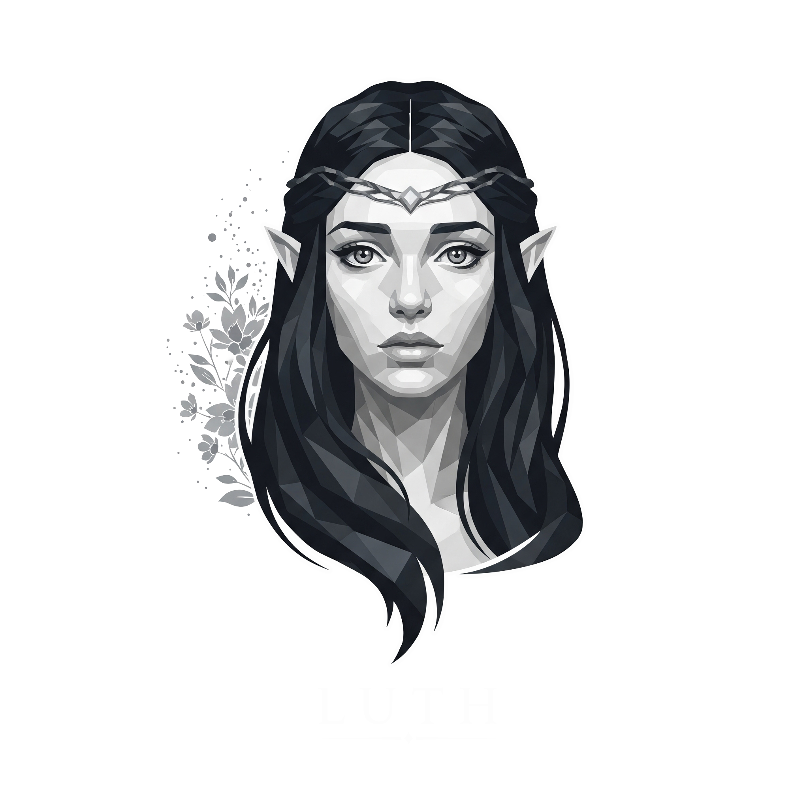
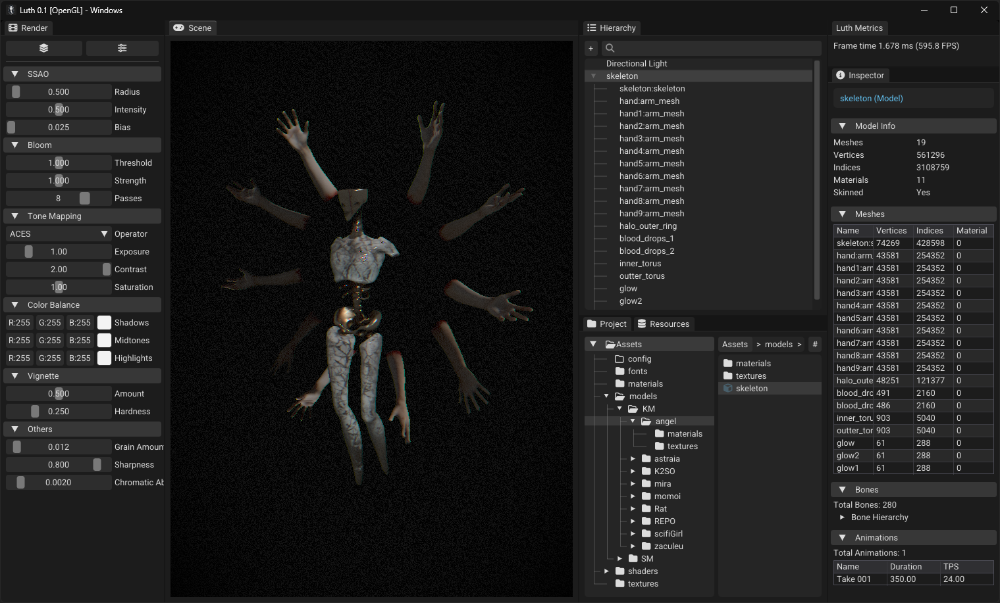

<p align="center">
  
</p>

# <p align="center"></p>

<p align="center">
  <a href="https://github.com/Hekbas/Luth/actions"></a>
  
  
  
  
</p>

<p align="center">
  A C++ wannabe engine built from scratch as part of my Bachelor's Thesis.<br>
  Currently under active development, serves as both a learning platform and research project.
</p>
<p align="center">
  Or it might just be a playground to test my sanity.
</p>

<p align="center">
  
</p>

---

## Getting Started

### Prerequisites
- **Windows 10/11**: Currently, the engine is developed and tested primarily on Windows.
- **Compiler**: A C++20 compatible compiler (MSVC, GCC, Clang)
- [Vulkan SDK](https://vulkan.lunarg.com) (1.3+) Required for the Vulkan rendering backend.

### Clone the Repository

1.  **Clone the repository + submodules**
    ```bash
    git clone --recursive https://github.com/Hekbas/Luth.git
    ```
2. **If submodules were skipped, initialize them afterward:**
    ```bash
    git submodule init
    git submodule update
    ```  
3.  **Generate project files with Premake:**  
    Run ``scripts/setup/setup_windows.bat``

---

## Features

* **Modern C++:** Uses modern C++20 features.
* **Entity-Component-System (ECS):** A data-oriented ECS architecture for managing game objects and logic.
* **Rendering:**
  * **Multi-API Support:** Pluggable renderer backend with support for **OpenGL** and **Vulkan**.
  * **Deferred Rendering Pipeline:** A rendering pipeline composed of the following passes:
    * Geometry Pass
    * Screen-Space Ambient Occlusion (SSAO) Pass
    * Lighting Pass
    * Transparent Objects Pass
    * Post-Processing Pass
* **Integrated Editor:** An editor built with ImGui provides the following panels:
  * Scene & Render Panels
  * Entity Hierarchy
  * Component Inspector
  * Project & Resource Management Panels
* **Resource Management:**
  * Virtual File System for abstracting asset paths.
  * Resource Database using metadata (`.meta` files).
  * Libraries for materials, models, and shaders.
* **Event System:** A bus-based event system for decoupled communication.
* **Core Utilities:** A foundation of tools including logging, a thread pool, custom data types, and math helpers.

---

## Dependencies & Libraries Used

LUTH Engine uses several open-source libraries:

* [**ImGui**](https://github.com/ocornut/imgui): For the integrated editor interface.
* [**EnTT**](https://github.com/skypjack/entt): For the Entity-Component-System implementation.
* [**GLFW**](https://www.glfw.org/): For windowing and input.
* [**GLAD**](https://glad.dav1d.de/): For loading OpenGL function pointers.
* [**GLM**](https://glm.g-truc.net/0.9.9/index.html): For mathematics.
* [**spdlog**](https://github.com/gabime/spdlog): For logging.
* [**stb_image**](https://github.com/nothings/stb/blob/master/stb_image.h): For loading images.
* [**assimp**](https://www.assimp.org/): For importing 3D models.
* [**nlohmann/json**](https://github.com/nlohmann/json): For serialization and JSON handling.
* [**Vulkan SDK**](https://www.lunarg.com/vulkan-sdk/): For the Vulkan rendering backend.