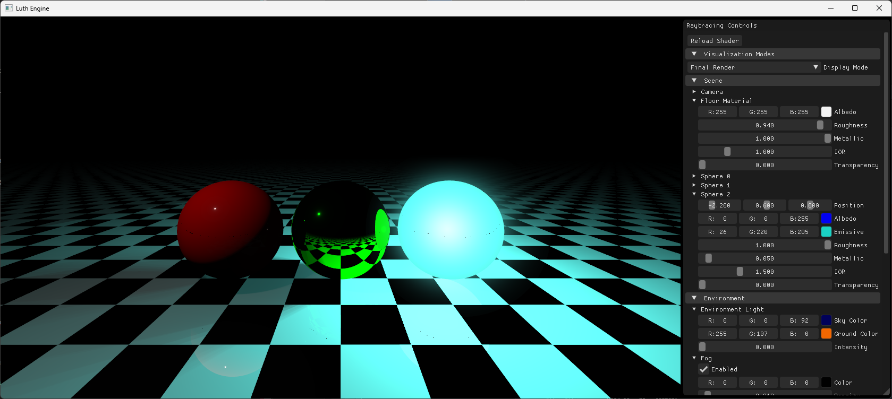

# Luth Engine

**A modern C++ game engine with multi-renderer support (OpenGL + Vulkan) designed for performance and flexibility.**  

[](https://github.com/Hekbas/Luth/actions)
[](https://github.com/Hekbas/Luth/releases/latest)
[](LICENSE)



## Getting Started 🛠️

### Prerequisites
- **Windows**: C++20 compatible compiler
- [Vulkan SDK](https://vulkan.lunarg.com) (1.3+)

### Clone the Repository
Clone with submodules using:
```bash
git clone --recursive https://github.com/Hekbas/Luth.git
```
If submodules were skipped, initialize them afterward:

```bash
git submodule init
git submodule update
```
### Build (Windows)
Run ``scripts/setup/setup_windows.bat``  
Replace vs2022 with your Visual Studio version if needed, e.g., vs2019.

## Features ✨

### Systems
- Window Management
- Input Handling
- Custom Logging System
- Math Library
- Resource Management (WIP)
- Dual Renderer Backend

### Graphics
**Vulkan Features**:
- Swapchain management
- Pipeline state objects
- Command buffer system
- Synchronization (Fences/Semaphores)

**OpenGL Features**:
- Modern GLAD loader
- Vertex Array Objects
- Batch rendering foundation

## Dependencies 📦
- **GLFW 3.4**: Window/input management.
- **glad**: OpenGL/Vulkan loader.
- **glm 1.0.1**: Math library.
- **assimp v5.4.3**: Asset import pipeline.
- **ImGui v1.91.8-docking**: Debugging/editor UI.
- **Vulkan SDK**: Cross-platform graphics API.
