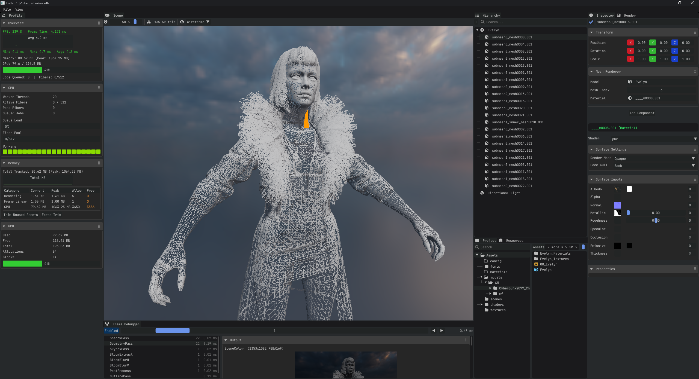

<p align="center">
  
</p>

<p align="center">
  <a href="https://github.com/Hekbas/Luth/actions"></a>
  
  
  
  
</p>

<p align="center">
  <b>C++ game engine built to explore high-performance architecture.</b><br>
  Currently under active development, serves as both a learning platform and research project.
</p>
<p align="center">
  Or it might just be a playground to test my sanity.
</p>

> [!IMPORTANT]
> <i>My original Bachelor's Thesis version is archived in the <code>thesis</code> branch.</i>

<p align="center">
  
</p>

---

## Why Luth?

Honestly? I just really love this stuff.

It started with my Bachelor's Thesis, where I designed a dual-renderer engine to benchmark Vulkan path tracing against traditional OpenGL PBR. The focus was purely on real-time graphics, so the underlying architecture was single-threaded. It worked, and I had a blast building it!

Then I watched Christian Gyrling’s GDC talk on *[Parallelizing the Naughty Dog Engine Using Fibers](https://www.gdcvault.com/play/1022186/Parallelizing-the-Naughty-Dog-Engine)*. Seeing how they saturated every single CPU core made me realize that my "simple loop" was basically running with the parking brake on.

So, I started Luth from scratch to explore high-performance architecture: fiber-based job systems, lock-free memory models, and bindless Vulkan rendering. It is absolutely over-engineered for a solo project, but that’s the point.

---

## Technical Architecture

Luth moves away from standard C++ patterns (RAII everywhere, heavy STL usage, single-threaded contexts) in favor of **Data-Oriented Design** and **Fiber-Based Concurrency**.

### 1. The Fiber Job System
Instead of spawning OS threads for specific tasks (like a "Render Thread" or "Audio Thread"), Luth treats the CPU as a generic pool of workers.
* **N:M Threading:** The engine spawns one Worker Thread per CPU core. Logical tasks are wrapped in **Fibers** (lightweight user-mode stacks) that can migrate between workers.
* **Zero Blocking:** The engine is designed to never sleep. If a job needs to wait for a dependency (or the GPU), it yields execution to the scheduler, which immediately swaps in another fiber. This keeps CPU saturation near 100%.
* **Naughty Dog Inspiration:** The scheduler implementation utilizes **Adaptive Mutexes** (spinning briefly before yielding) and **Atomic Counters** for synchronization to avoid priority inversion.

### 2. Pipelined Frame Execution
To hide latency, the engine pipelines execution across three distinct stages running in parallel. At any given moment $T$, the engine is processing three frames simultaneously:
1.  **Frame N (Game Logic):** Physics, AI, and Transform updates run on the CPU.
2.  **Frame N-1 (Render Logic):** The results of the previous game frame are read to record Vulkan Command Buffers in parallel.
3.  **Frame N-2 (GPU execution):** The GPU executes the commands submitted for the frame prior.

### 3. Memory Strategy
Standard `new`/`delete` calls are forbidden in the hot path. Luth uses a strict memory hierarchy to handle the complexity of fiber migration:
* **Tagged Page Allocator:** A Naughty Dog-style allocator using 2MB virtual pages. Memory is allocated with a specific "Tag" (e.g., `LevelGeometry`, `Frame_N`) and freed in bulk. It uses per-thread caches to allow lock-free allocations during gameplay.
* **Frame Packets:** Linear allocators that reset every frame. Used for transient data like command lists or UI state. This eliminates destructor overhead for 90% of runtime objects.

### 4. Vulkan 1.3 Backend
The renderer is built for modern hardware, focusing on reducing driver overhead.
* **Bindless Descriptors:** Uses `VK_EXT_descriptor_indexing` to bind all engine textures to a single global array (`Set 0`). Materials simply store an integer index, allowing any draw call to access any texture without rebinding sets.
* **Dynamic Rendering:** Eliminates legacy `VkRenderPass` and `VkFramebuffer` objects.
* **Timeline Semaphores:** Replaces `vkWaitForFences`. A dedicated **Poller Job** runs on the CPU, querying semaphore values and waking up dependent fibers only when the GPU has finished a specific workload.

---

## Build Instructions

**Prerequisites:**
- **OS**: Windows 10/11
- **Compiler**: MSVC (v143+) or Clang (C++20 compliant)
- **SDK**: [Vulkan SDK 1.3+](https://vulkan.lunarg.com)

**Steps:**
1.  **Clone the repository + submodules**
    ```bash
    git clone --recursive https://github.com/Hekbas/Luth.git
    ```
2.  **Generate Project Files**:
    Run the setup script to run Premake:
    ```bash
    scripts/setup_windows.bat
    ```
3.  **Build**:
    Open the generated solution `Luth.sln` and build the project.

---

## Dependencies & Libraries

LUTH Engine is built on the shoulders of giants:

* [**Vulkan SDK**](https://www.lunarg.com/vulkan-sdk/): The core rendering backend.
* [**EnTT**](https://github.com/skypjack/entt): Fast Entity-Component-System (ECS).
* [**ImGui**](https://github.com/ocornut/imgui): Immediate Mode GUI for the Editor.
* [**Jolt Physics**](https://github.com/jrouwe/JoltPhysics): (Planned) High-performance rigid body physics.
* [**Tracy**](https://github.com/wolfpld/tracy): Real-time remote frame profiling.
* [**SPIRV-Cross**](https://github.com/KhronosGroup/SPIRV-Cross): Shader reflection and cross-compilation.
* [**GLFW**](https://www.glfw.org/): Windowing and Input management.
* [**GLM**](https://glm.g-truc.net/): Mathematics library.
* [**spdlog**](https://github.com/gabime/spdlog): Fast C++ logging.
* [**assimp**](https://github.com/assimp/assimp): Asset importing (Models).
* [**stb_image**](https://github.com/nothings/stb): Image loading.
* [**nlohmann/json**](https://github.com/nlohmann/json): JSON serialization.

---

## Current State & Roadmap

The engine has recently undergone a massive architectural reboot to fully implement the **Fiber/Vulkan integration** described above. 

**Completed Core Features:**
* Complete lock-free Job System using Win32 Fibers and Chase-Lev work-stealing deques.
* Custom memory allocators (Linear Frame Packets, Tagged Page Allocator) avoiding `std::mutex` and `new`/`delete` in the hot path.
* Fully pipelined frame execution `Game(N) -> Render(N-1) -> GPU(N-2)`.
* Vulkan 1.3 backend featuring Dynamic Rendering and Timeline Semaphores.
* Parallel Render Graph utilizing worker threads for secondary command buffer recording.

Development is currently focused on expanding the rendering features (PBR, cascaded shadow maps, post-processing) and building the asset streaming pipeline.