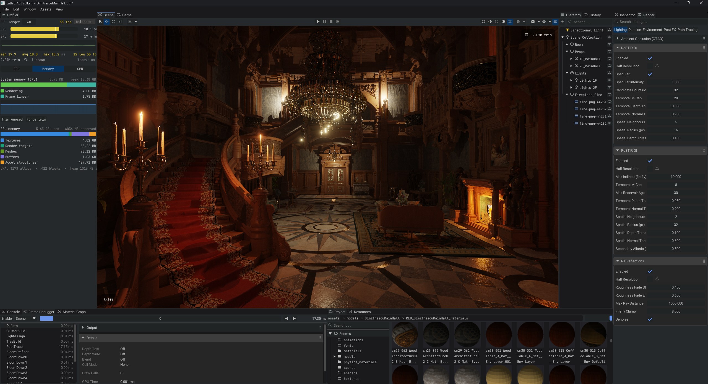
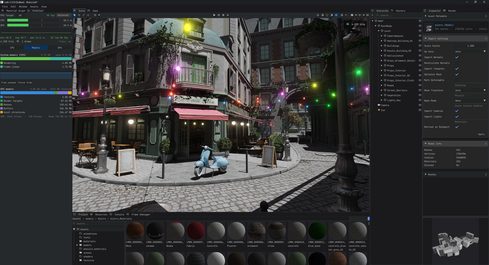
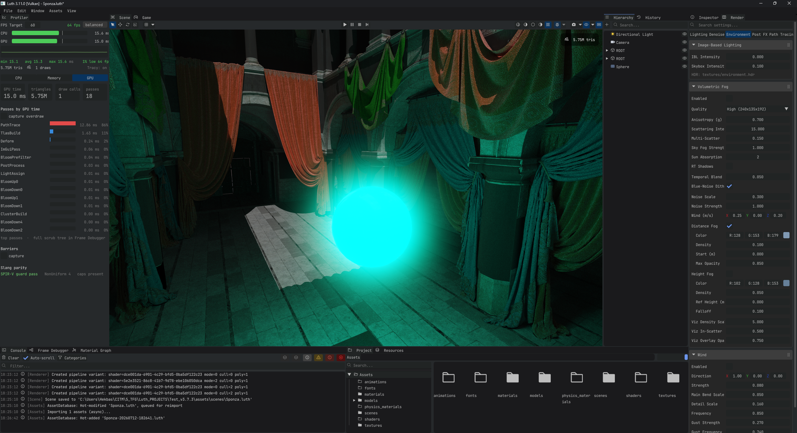
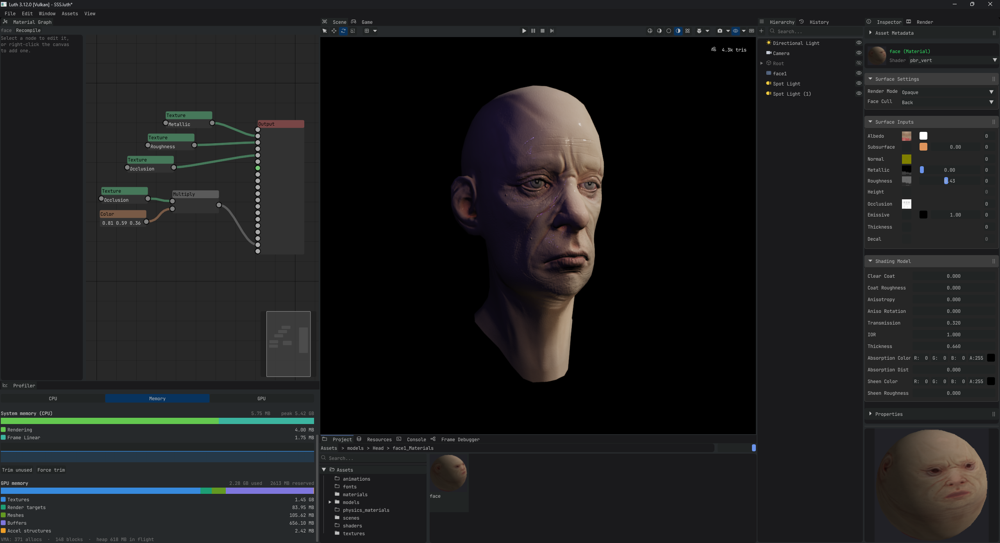
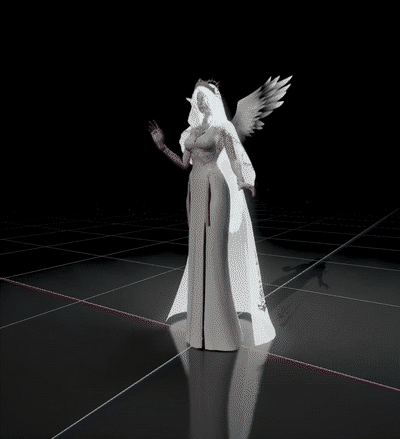

<p align="center">
  
</p>

<p align="center">
  <a href="https://github.com/Hekbas/Luth/releases/latest">
    
  </a>
  <a href="https://github.com/Hekbas/Luth/actions">
    
  </a>
  
<br>
  
  

  <a href="https://github.com/Hekbas/Luth/blob/main/LICENSE">
    
  </a>
</p>

<p align="center">
  <b>C++ game engine built to explore high-performance architecture.</b><br>
  Currently under active development, serves as both a learning platform and research project.
</p>
<p align="center">
  Or it might just be a playground to test my sanity.
</p>

> [!IMPORTANT]
> <i>My original Bachelor's Thesis version is archived in the <code>thesis</code> branch.</i>

<p align="center">
  
</p>

---

## Why Luth?

Honestly? I just really love this stuff.

It started with my Bachelor's Thesis: a dual-renderer engine benchmarking Vulkan path tracing against traditional OpenGL PBR. The focus was purely real-time graphics, so the architecture underneath was single-threaded. It worked, and I had a blast building it!

Then I watched Christian Gyrling's GDC talk, *[Parallelizing the Naughty Dog Engine Using Fibers](https://www.gdcvault.com/play/1022186/Parallelizing-the-Naughty-Dog-Engine)*, and saw how they saturate every core on the CPU. It made me realise how much I still had left to explore.

So I restarted Luth from scratch to chase exactly that: fiber-based job systems, lock-free memory, bindless Vulkan, and hardware ray tracing. It is absolutely over-engineered for a solo project, but that’s the point.

---

## Gallery

<table>
  <tr>
    <td width="50%"></td>
    <td width="50%"></td>
  </tr>
  <tr>
    <td align="center"><b>Bistro</b> · clustered Forward+, ray-traced sun shadows</td>
    <td align="center"><b>Emissive meshes</b> · ReSTIR area lights, path-traced</td>
  </tr>
  <tr>
    <td width="50%"></td>
    <td width="50%"></td>
  </tr>
  <tr>
    <td align="center"><b>Subsurface skin</b> · authored in the node material graph</td>
    <td align="center"><b>Volumetric god rays</b> · froxel fog</td>
  </tr>
</table>

<p align="center">
  <br>
  <i>Skeletal animation and GPU skinning</i>
</p>

<p align="center"><i>More shots land with each <a href="https://github.com/Hekbas/Luth/releases">release</a>.</i></p>

---

## Shuddup! how build??

**Prerequisites:**
- **OS**: Windows 10 / 11
- **Compiler**: MSVC (v143+) or Clang (C++20-compliant)
- **GPU**: Hardware ray tracing required (`VK_KHR_ray_query` + acceleration structures). NVIDIA RTX 20-series or newer, AMD RX 6000+, or Intel Arc
- **SDK**: [Vulkan SDK 1.3+](https://vulkan.lunarg.com), with `dynamicRendering`, `timelineSemaphore`, descriptor indexing (UBO update-after-bind), and the KHR ray-tracing extensions

**Steps:**
1.  **Clone with submodules**
    ```bash
    git clone --recursive https://github.com/Hekbas/Luth.git
    ```
2.  **Generate the VS solution**
    ```bash
    scripts/setup/setup_windows.bat
    ```
3.  **Build.** Either open `Luth.sln` in Visual Studio 2022, or run the headless script:
    ```bash
    scripts/build/build_windows.bat
    ```

The editor binary lands at `bin/windows-x86_64/Debug/Runtime/Luthien.exe`.

---

## Architecture

The short tour. Full detail lives in [ARCHITECTURE.md](docs/development/ARCHITECTURE.md) and the per-system references under [docs/development/arch/](docs/development/arch/).

- **Fiber job system.** One worker thread per core. Logical tasks run as lightweight, migratable fibers that yield to the scheduler instead of blocking the OS, so the CPU stays near-saturated. FLS, Chase-Lev work-stealing deques, lock-free queues, spin-locks on the hot path. The context switch is hand-written x86-64 assembly over `VirtualAlloc` stacks, so every fiber stack is AddressSanitizer-trackable.
- **Pipelined frames.** Game (N), Render (N-1), and GPU (N-2) run at the same time. The handoff between stages is an immutable per-frame snapshot, never shared mutable state.
- **Tagged allocators.** No `new` / `delete` on the hot path. A Naughty Dog-style Onion/Garlic split: CPU and GPU tagged page allocators (bulk-freed by tag, GPU pages retiring on the timeline) plus a per-frame linear allocator.
- **Bindless Vulkan 1.3.** Dynamic rendering and timeline semaphores only, no legacy render passes or fences. One global texture array and buffer device addresses mean draws carry integer indices instead of rebinding.
- **Render graph.** Each frame builds a DAG of passes that declare their reads and writes. The graph solves barriers, culls unused passes, and records commands in parallel across workers.

> The scheduler, allocators, and lock-free primitives run under a dedicated 28-case ASan stress harness.

---

## Features

### Rendering

| | |
|---|---|
| **Real-Time Ray Tracing** | Hardware ray query: RT sun shadows, ReSTIR direct + global illumination, stochastic RT reflections. Per-frame TLAS, bindless geometry table |
| **Path-Traced Reference** | rayQuery megakernel with multi-bounce next-event estimation and progressive accumulation. Ground truth to A/B the real-time path |
| **Denoising** | SVGF across three channels (diffuse DI, indirect GI, specular) behind a swappable `IDenoiser` |
| **Clustered Forward+** | Log-slice light clusters with a slim G-buffer prepass, ECS-driven |
| **Lights** | Directional sun, plus clustered and GPU-culled point and spot lights |
| **PBR Materials** | Cook-Torrance metallic/roughness with Opaque, Cutout, and order-independent Transparent modes |
| **Node Material Editor** | Blender-style graph that generates Slang per material, identical raster and RT output, live recompile, exposed parameters |
| **Shading Models** | Clear coat, anisotropy, dielectric transmission (glass), sheen (cloth), and subsurface scattering (skin), across the raster and path-traced paths |
| **Surface Detail** | Parallax occlusion mapping and projected decals, authored in the node graph |
| **Shadows** | RT ray-query sun shadows by default; 4-cascade PSSM kept as an A/B toggle |
| **Volumetric Fog** | Froxel grid: inject, integrate, temporal resolve, composite. Optional per-froxel RT fog shadows |
| **Ambient Occlusion** | GTAO half-res compute (prefilter, horizon integral, bilateral denoise) |
| **IBL** | HDR skybox, diffuse irradiance, pre-filtered specular, BRDF LUT, split-sum ambient |
| **Anti-Aliasing** | TAA plus specular anti-aliasing |
| **Vertex Deformation** | GPU compute deformation shared by raster and the RT BLAS, driven by procedural wind |
| **GPU Culling** | Compute frustum culling per cascade and main scene, indirect draws throughout |
| **Async Compute** | Three-queue Vulkan topology (graphics, async compute, transfer); GTAO and RT chains overlap on the compute queue |
| **Bindless** | Buffer device addresses and one global 16k-texture array; integer material and texture indices |
| **Post-Processing** | HDR pipeline: bloom, ACES and AgX tonemap operators, vignette, grain, chromatic aberration |
| **Shaders** | Slang-only asset pipeline with UUIDs, hot-reload, and SPIRV-Cross reflection |
| **Pipeline Cache** | Disk-persisted, lazy variant creation, targeted hot-reload invalidation |

### Animation

| | |
|---|---|
| **Sampling** | Fiber-parallel keyframe evaluation |
| **GPU Skinning** | Bone-matrix SSBO, vertex-shader skinning |
| **Blending** | SQT interpolation, crossfade transitions, layered override with bone masks |
| **Root Motion** | Extracted and applied to the entity transform |
| **Debug** | Bone overlay in the editor viewport |

### Physics

| | |
|---|---|
| **Backend** | Jolt Physics, jobified onto the fiber scheduler |
| **Rigid Bodies** | Static / Kinematic / Dynamic with CCD; primitive, convex-hull, and mesh shapes |
| **Materials** | UUID-keyed friction / restitution / density with hot-reload |
| **Character Controller** | Kinematic capsule (`JPH::CharacterVirtual`) with stair-stepping and stick-to-floor |
| **Queries** | Raycast and overlap (box / sphere / capsule), layer-mask filtered |
| **Events** | Contact and trigger add/remove, drained per frame |
| **Debug Draw** | Wire colliders colored by motion state or ground state |

### Asset Pipeline

| | |
|---|---|
| **Asset Database** | UUID registry with `.meta` sidecars; importers for shaders, textures, models, materials, animations |
| **Smart Import** | Multi-strategy texture discovery, drag-and-drop with eager import, texture remap dialog |
| **Texture Compression** | Import-time BCn: BC7 for color, BC5 for normals, uploaded on the transfer queue |
| **Model Import** | Full DCC hierarchy, cameras, and lights, not just meshes; render-mode and cull flags from the source |
| **Hot Reload** | FileWatcher-driven live reload for shaders, textures, and project files |
| **Scene Format** | JSON `.luth` with dirty tracking and native file dialogs |

### Editor

| | |
|---|---|
| **Scene Interaction** | Mouse picking, selection outlines, multi-select, shade modes (Lit / Wireframe / Unlit and debug views) |
| **Inspector** | Material editor, animation controls, light and shadow settings, per-component copy/paste, Add Component |
| **Live Preview** | Orbit-camera 3D preview for material and model assets |
| **Play Mode** | Editing / Playing / Paused state machine, JSON scene snapshot, transport bar |
| **Game Panel** | Camera-driven runtime view with letterbox, no overlays |
| **Project Panel** | Folder navigation, search, rendered thumbnails, context menus |
| **Undo / Redo** | Command pattern with UUID entity resolution, gizmo-drag coalescing, compound commands |
| **Frame Debugger** | Freeze a frame, scrub through every draw, replay any single one to see what it did |
| **Profiler** | Scheduler, memory, and per-pass GPU dashboard with fiber-aware instrumentation |
| **GPU Crash Debugging** | Nsight Aftermath device-lost dumps plus tiered Vulkan validation |
| **Console** | Per-subsystem log channels with level filter and search |
| **Persistence** | Named workspaces: window layouts and panel state saved across sessions |

---

## Roadmap

See the [development roadmap](docs/development/ROADMAP.md) for completed work and version history, and [FUTURE.md](docs/development/FUTURE.md) for the long-tail wishlist.

**Next up:** GPU particle system, scripting (C# or Lua), prefab system, animation blend trees and IK, procedural sky.

---

## Dependencies

Luth is built on the shoulders of giants:

| | |
|---|---|
| [**Vulkan SDK**](https://www.lunarg.com/vulkan-sdk/) | Rendering backend |
| [**Slang**](https://github.com/shader-slang/slang) | Shader language and compiler (SPIR-V) |
| [**SPIRV-Cross**](https://github.com/KhronosGroup/SPIRV-Cross) | Shader reflection |
| [**VMA**](https://github.com/GPUOpen-LibrariesAndSDKs/VulkanMemoryAllocator) | Vulkan memory allocator |
| [**EnTT**](https://github.com/skypjack/entt) | Entity-Component-System |
| [**ImGui**](https://github.com/ocornut/imgui) | Editor GUI |
| [**ImGuizmo**](https://github.com/CedricGuillemet/ImGuizmo) | Gizmos and the node graph editor widget |
| [**Phosphor Icons**](https://phosphoricons.com/) | Editor icon set |
| [**Tracy**](https://github.com/wolfpld/tracy) | Frame profiler |
| [**Nsight Aftermath**](https://developer.nvidia.com/nsight-aftermath) | GPU crash dumps on device-lost (optional) |
| [**GLFW**](https://www.glfw.org/) | Windowing and input |
| [**GLM**](https://glm.g-truc.net/) | Math |
| [**spdlog**](https://github.com/gabime/spdlog) | Logging |
| [**assimp**](https://github.com/assimp/assimp) | Model importing |
| [**stb_image**](https://github.com/nothings/stb) | Image loading |
| [**bc7enc_rdo**](https://github.com/richgel999/bc7enc_rdo) | BCn texture compression (BC7 / BC5 / BC1) |
| [**nlohmann/json**](https://github.com/nlohmann/json) | JSON serialization |
| [**Jolt Physics**](https://github.com/jrouwe/JoltPhysics) | Rigid-body physics |

---

## References & Further Reading

Luth implements ideas from these papers and talks. If you want to understand a system, start here.

| Area | Source |
|---|---|
| Fiber job system | Gyrling, [*Parallelizing the Naughty Dog Engine Using Fibers*](https://www.gdcvault.com/play/1022186/Parallelizing-the-Naughty-Dog-Engine) (GDC 2015) |
| Clustered Forward+ | Olsson, Billeter, Assarsson, [*Clustered Deferred and Forward Shading*](https://www.cse.chalmers.se/~uffe/clustered_shading_preprint.pdf) (HPG 2012) |
| ReSTIR direct lighting | Bitterli et al., [*Spatiotemporal Reservoir Resampling*](https://benedikt-bitterli.me/restir/) (SIGGRAPH 2020) |
| ReSTIR global illumination | Ouyang et al., [*ReSTIR GI: Path Resampling for Real-Time Path Tracing*](https://research.nvidia.com/publication/2021-06_restir-gi-path-resampling-real-time-path-tracing) (HPG 2021) |
| SVGF denoising | Schied et al., [*Spatiotemporal Variance-Guided Filtering*](https://cg.ivd.kit.edu/publications/2017/svgf/svgf_preprint.pdf) (HPG 2017) |
| Ground-truth AO | Jimenez et al., [*Practical Real-Time Strategies for Accurate Indirect Occlusion*](https://www.iryoku.com/downloads/Practical-Realtime-Strategies-for-Accurate-Indirect-Occlusion.pdf) (SIGGRAPH 2016) |
| Volumetric fog | Wronski, [*Volumetric Fog*](https://bartwronski.com/publications/) (SIGGRAPH 2014); Hillaire, [*Physically Based Volumetric Rendering*](https://www.ea.com/frostbite/news/physically-based-unified-volumetric-rendering-in-frostbite) (2015) |
| Temporal AA | Karis, [*High-Quality Temporal Supersampling*](https://advances.realtimerendering.com/s2014/) (SIGGRAPH 2014) |
| Specular AA | Tokuyoshi, Kaplanyan, [*Improved Geometric Specular Antialiasing*](https://yusuketokuyoshi.com/papers/2019/ImprovedGeometricSpecularAA.pdf) (i3D 2019) |
| PBR shading | Burley, [*Physically Based Shading at Disney*](https://media.disneyanimation.com/uploads/production/publication_asset/48/asset/s2012_pbs_disney_brdf_notes_v3.pdf) (2012); Karis, [*Real Shading in Unreal Engine 4*](https://blog.selfshadow.com/publications/s2013-shading-course/karis/s2013_pbs_epic_notes_v2.pdf) (2013) |
| Tonemapping | Troy Sobotka, [*AgX*](https://github.com/sobotka/AgX) |

---

## License

Released under the [MIT License](LICENSE).
