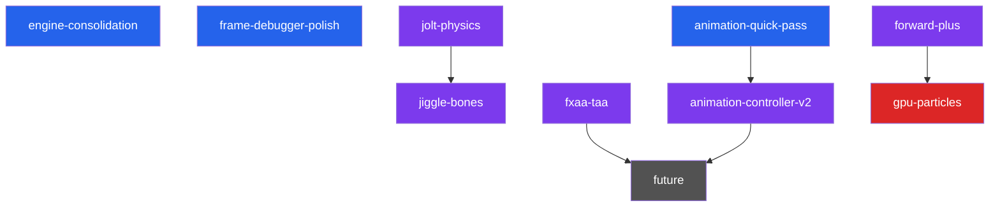

# Luth Engine — Backlog

> Definitive plan for planned epics. Each section expands the short entry in [`ROADMAP.md`](ROADMAP.md). Effort scale: **S** (hours) / **M** (½–1 day) / **L** (2–5 days) / **XL** (multi-week).

---

## Architecture Snapshot (v2.8.2)

What exists today — directly shapes sequencing for remaining work.

| Capability | Status | Notes |
|-----------|--------|-------|
| Render Graph (DAG, barriers, culling) | ✅ Graphics + compute + buffers | Shipped in `compute-gpu-culling` (v1.2.0) |
| Compute shaders | ✅ Formal pipeline, render-graph integrated | `VulkanComputePipeline` + pipeline cache |
| Draw submission | ✅ `vkCmdDrawIndexedIndirect` everywhere | GPU frustum cull |
| Buffer resources | ✅ SSBO tracked in render graph | `ResourceState::ComputeRead/Write`, `StorageBuffer` |
| Queue | ✅ Single graphics queue (compute on same) | Async compute = future |
| Forward PBR | ✅ 3 render modes, 6 descriptor sets | Forward+ extends Set 3 |
| Shadows | ✅ 4-cascade PSSM, per-cascade GPU cull | Shipped in `csm` (v1.3.0) |
| GTAO | ✅ Half-res compute, Jimenez 2016 | Shipped (v1.5.0) |
| Animation | ✅ Sampling, blending, root motion, GPU skinning | Jiggle bones slot in after sampling |
| Play mode | ✅ Editor state machine + scene snapshot | Shipped (v2.8.0) |
| Game panel | ✅ Letterbox + first-Camera entity | Shipped (v2.8.1) |
| Profiling | ✅ Tracy CPU + GPUTimerPool | See [arch/profiling.md](arch/profiling.md) |
| Memory tracking | ✅ Categorized engine + Tracy STL hooks | See [arch/memory.md](arch/memory.md) |
| Undo/redo | ✅ 14 command types | New components need new command types |
| Scene serialization | ✅ JSON `.luth` | New components need serializer entries |
| Frame debugger | ✅ Per-draw archive + replay-then-copy, frozen-state | Shipped in `frame-debugger-sync` (v1.4.0) |

---

## Dependency Graph



> 🔵 Near-term · 🟣 Mid-term · 🔴 Advanced · ⚫ Future

---

## Epic: `engine-consolidation` — v2.8.2

> **Audit-driven housekeeping pass before resuming feature work.**

Roadmap restructure (Effort scale, terse summaries), four new arch sub-docs (memory / profiling / validation-layers / version-glossary), comment-banner sanitization, V1-V6 cross-ref standardization, Tracy memory hooks for STL/heap, Tracy CPU coverage expansion across editor panels and RG passes.

**Effort:** M

---

## Epic: `animation-quick-pass` — v2.8.4

> **UX polish + decouple animation clips from character.**

Two narrow goals:
1. Preview-toggle UX (clearer indicator when `previewAnimationInEditor` is on; surface in transport bar).
2. Allow multiple entities to share one rig and swap clips per-instance — current model embeds clip into character.

Mechanical, scoped change. Foundation for `animation-controller-v2` but not a state machine. State machine + blend trees stay in the v2 epic.

**Effort:** S

---

## Epic: `jolt-physics` — v2.9.0

> **Rigid body physics.** Makes Luth a game engine, not just a renderer.

### Architecture: Jolt on CPU via Fiber Job System

Jolt exposes a `JPH::JobSystem` interface. Implement to dispatch onto our fiber scheduler:

```cpp
class LuthJoltJobSystem : public JPH::JobSystem {
    // Map Jolt jobs → Luth::JobSystem::Execute()
    // Map Jolt barriers → Luth::AtomicCounter
};
```

### Key Changes

| Area | Detail |
|------|--------|
| **New components** | `RigidBody` (mass, restitution, friction, body type), `Collider` (box/sphere/capsule/mesh shape) |
| **PhysicsSystem** | New ECS system: `Init()` creates Jolt world, `Update()` steps simulation, syncs transforms |
| **Transform sync** | After Jolt step: `JPH::BodyInterface::GetWorldTransform()` → `Component::Transform` |
| **Debug draw** | Wireframe collider visualization in editor |
| **Raycasting** | `PhysicsSystem::Raycast()` for mouse picking, gameplay queries |
| **Editor integration** | Inspector for RigidBody/Collider, play-mode-only simulation |
| **Serialization** | RigidBody + Collider component serialization in `.luth` scenes |

**Dependencies:** `play-mode` ✅
**Effort:** XL

---

## Epic: `jiggle-bones` — Secondary Physics

> **Custom Verlet spring simulation.** ~200 lines, not Jolt.

Runs after animation sampling, before bone matrix SSBO upload. Per-bone Verlet integration + distance constraints + optional sphere collider push-out.

### Key Changes

| Area | Detail |
|------|--------|
| **New component** | `JiggleBone { BoneName, Stiffness, Damping, Gravity, [runtime: CurrentPos, PreviousPos] }` |
| **Chain support** | `JiggleChain { RootBoneName, ChainLength, Stiffness, Damping }` for ponytails/capes |
| **AnimationSystem** | Add jiggle simulation step after global transform computation |
| **Inspector** | Stiffness/damping sliders, gravity vector, visualization gizmo |
| **Serialization** | New component in scene format |

**Dependencies:** Benefits from `jolt-physics` for collider sources; not strictly required
**Effort:** M

---

## Epic: `forward-plus` — Clustered Lighting

> **Remove the 64 point light ceiling.** Thousands of lights with minimal overhead.

Replace fixed `LightUBO` with GPU-driven light assignment via clustered shading.

| Pass | Type | Detail |
|------|------|--------|
| **Cluster build** | Compute | Divide view frustum into 16×9×24 clusters; compute cluster AABBs |
| **Light assign** | Compute | For each light, find overlapping clusters; write light index lists |
| **GeometryPass** | Fragment | Read cluster for current fragment → iterate assigned lights only |

### Key Changes

| Area | Detail |
|------|--------|
| **Light SSBO** | Replace `LightUniforms` (fixed 64 lights) with unbounded SSBO |
| **Cluster SSBO** | Per-cluster light index list + offset/count table |
| **PBR shader** | Read cluster ID from fragment position; iterate cluster's light list |
| **Point light cap** | Raise from 64 to unlimited (practical: thousands) |

**Dependencies:** `compute-gpu-culling` ✅
**Effort:** L

---

## Epic: `fxaa-taa` — Anti-Aliasing

> **FXAA quick win + TAA pairs with GTAO temporal accumulation.**

| Technique | Effort | Notes |
|-----------|--------|-------|
| **FXAA** | S | Single fullscreen post-process pass. Lottes 2011 GLSL impl. Drop-in after post-process. |
| **TAA** | M | Requires motion vectors (per-object velocity buffer), Halton jitter, history buffer, neighborhood clamping. Improves GTAO + removes temporal flickering. |

**Dependencies:** TAA needs per-object previous-frame transforms (pairs with `compute-gpu-culling` ✅)

---

## Epic: `animation-controller-v2` — State Machine + Blend Trees

> **Real animation graph.** State machine + 1D/2D blend trees + retargetable rigs. Scales to 30+ animations per character.

Successor to v1.0 `animation-system`. New asset format for the controller graph; runtime evaluator inside `AnimationSystem`; editor graph view.

### Key Changes

| Area | Detail |
|------|--------|
| **AnimationController asset** | New `.luth.controller` artifact: states, transitions, parameters, blend trees |
| **Runtime evaluator** | State machine ticks per entity; pose blending replaces direct clip sampling |
| **Retargetable rigs** | Skeleton remap when controller's source rig differs from instance's |
| **Editor graph view** | Node-based controller editor (panel) |
| **Inspector** | Per-entity controller binding + parameter exposure |

**Dependencies:** `animation-quick-pass` (rig/clip decoupling lands first)
**Effort:** XL

---

## Epic: `gpu-particles` — GPU Particle System

> **First fully GPU-driven simulation.** Compute emit → simulate → render via indirect draw.

| Pass | Type | Detail |
|------|------|--------|
| **Emit** | Compute | Spawn particles from emitter configs, write to particle SSBO |
| **Simulate** | Compute | Integrate positions, apply forces/gravity, decay lifetime, kill dead |
| **Compact** | Compute | Stream compaction to remove dead particles |
| **Render** | Graphics (indirect) | Point sprites or billboards via `vkCmdDrawIndirect` |

**Dependencies:** `compute-gpu-culling` ✅, `forward-plus` (for lit particles, optional)
**Effort:** L

---

## Future (Not Scoped)

Beyond planned epics, ordered roughly by value:

| Feature | Depends On | Notes |
|---------|-----------|-------|
| **Shadow frustum-union fit** | `game-panel` ✅ | CSM refits per view (2× shadow cost with game panel open); one union fit covers all active views |
| **Frame Debugger per-view capture** | `game-panel` ✅ | Capture currently scene-view-only; extend tracked RTs + archive slots to tag by view |
| **Auto-wire `GPUTimerPool` into RenderGraph** | — | Currently per-pass insertion is manual |
| **Scene-panel post-process toggle** | — | Unity-style toggle to disable bloom/tonemap/vignette for lookdev |
| **Tracked STL allocators (`LH::Vector<T>`)** | — | Closes the STL gap on `MemoryTracker` (currently covered only by Tracy hooks) |
| **HZB Occlusion Culling** | `compute-gpu-culling` ✅ | Two-phase cull pipeline; depth pyramid as compute |
| **Prefab System** | `play-mode` ✅, `jolt-physics` | Entity templates with override tracking |
| **Scripting (C# or Lua)** | `play-mode` ✅, `jolt-physics` | Requires play mode + physics for meaningful scripts |
| **Asset Streaming** | `compute-gpu-culling` ✅ | Async GPU upload via transfer queue |
| **Deferred GBuffer** | `forward-plus` | If Forward+ hits limits; unlocks SSR, decals |
| **SSR (Screen-Space Reflections)** | GBuffer or depth | Hi-Z traced reflection |
| **Volumetric Fog** | `compute-gpu-culling` ✅, `forward-plus` | Froxel-based, compute-driven |
| **3D Spatial Audio** | `play-mode` ✅ | Orthogonal; integrate when demo needs it |
| **Ragdoll** | `jolt-physics`, `animation-controller-v2` | Bone driven by Jolt body during ragdoll state |
| **Animation v3 (DQS, IK, morph targets)** | `animation-controller-v2` | Beyond state machine + blend trees |
| **Visual Shader Editor** | — | Editor luxury, low priority |
