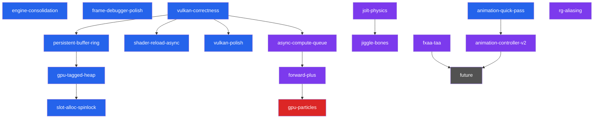

# Luth Engine — Backlog

> Definitive plan for planned epics. Each section expands the short entry in [`ROADMAP.md`](ROADMAP.md). Effort scale: **S** (hours) / **M** (½–1 day) / **L** (2–5 days) / **XL** (multi-week).

---

## Architecture Snapshot (v2.8.2)

What exists today — directly shapes sequencing for remaining work.

| Capability | Status | Notes |
|-----------|--------|-------|
| Render Graph (DAG, barriers, culling) | ✅ Graphics + compute + buffers | Shipped in `compute-gpu-culling` (v1.2.0) |
| Compute shaders | ✅ Formal pipeline, render-graph integrated | `VulkanComputePipeline` + pipeline cache |
| Draw submission | ✅ `vkCmdDrawIndexedIndirect` everywhere | GPU frustum cull |
| Buffer resources | ✅ SSBO tracked in render graph | `ResourceState::ComputeRead/Write`, `StorageBuffer` |
| Queue | ✅ Single graphics queue (compute on same) | Async compute = future |
| Forward PBR | ✅ 3 render modes, 6 descriptor sets | Forward+ extends Set 3 |
| Shadows | ✅ 4-cascade PSSM, per-cascade GPU cull | Shipped in `csm` (v1.3.0) |
| GTAO | ✅ Half-res compute, Jimenez 2016 | Shipped (v1.5.0) |
| Animation | ✅ Sampling, blending, root motion, GPU skinning | Jiggle bones slot in after sampling |
| Play mode | ✅ Editor state machine + scene snapshot | Shipped (v2.8.0) |
| Game panel | ✅ Letterbox + first-Camera entity | Shipped (v2.8.1) |
| Profiling | ✅ Tracy CPU + GPUTimerPool | See [arch/profiling.md](arch/profiling.md) |
| Memory tracking | ✅ Categorized engine + Tracy STL hooks | See [arch/memory.md](arch/memory.md) |
| Undo/redo | ✅ 14 command types | New components need new command types |
| Scene serialization | ✅ JSON `.luth` | New components need serializer entries |
| Frame debugger | ✅ Per-draw archive + replay-then-copy, frozen-state | Shipped in `frame-debugger-sync` (v1.4.0) |

---

## Dependency Graph



> 🔵 Near-term · 🟣 Mid-term · 🔴 Advanced · ⚫ Future

---

## Epic: `engine-consolidation` — v2.8.2

> **Audit-driven housekeeping pass before resuming feature work.**

Roadmap restructure (Effort scale, terse summaries), four new arch sub-docs (memory / profiling / validation-layers / version-glossary), comment-banner sanitization, V1-V6 cross-ref standardization, Tracy memory hooks for STL/heap, Tracy CPU coverage expansion across editor panels and RG passes.

**Effort:** M

---

## Epic: `animation-quick-pass` — v2.8.8

> **Status: Shipped v2.8.8** — see [`history/v2.x/animation-quick-pass.md`](history/v2.x/animation-quick-pass.md).

Decoupled animation clips from `Model`: clips became first-class UUID-addressable assets, `ModelImporter` emits one `.anim` per clip, runtime + scene + inspector switched to UUID handles. Preview-toggle UX (originally listed) was deferred to a future polish item.

---

## Epic: `persistent-buffer-ring` — v2.8.9

> **Status: Shipped v2.8.9** — see [`history/v2.x/persistent-buffer-ring.md`](history/v2.x/persistent-buffer-ring.md).

Triple-buffered the three persistent CPU-mapped SSBOs (ObjectSSBO Set 5, IndirectBuffer, Material SSBO Set 2) with single-buffer slice math. Cull compute gained a `srcOffset` push-constant; Material dirty-frame countdown propagates a single mutation across slices. VMA modernized off deprecated `CPU_TO_GPU` flag to `AUTO + HOST_ACCESS_SEQUENTIAL_WRITE_BIT + MAPPED_BIT` with per-slice `vmaFlushAllocation` (no-op on coherent memory).

---

## Epic: `gpu-tagged-heap` — v2.8.10

> **Status: Shipped v2.8.10** — see [`history/v2.x/gpu-tagged-heap.md`](history/v2.x/gpu-tagged-heap.md).

Built `Memory::GPUTaggedPageAllocator` (sibling to CPU `TaggedPageAllocator`): 2 MB pages from 64 MB host-visible mapped backings, tag-based bulk-free wired to GPU N-2 timeline completion in `AcquireImage`. Material / Object / Indirect / `BoneMatrixBuffer` all migrated; v2.8.9's slot-encoded ring buffers and the `gpu_cull.comp` `srcOffset` push-constant dissolved (push range 108B → 104B). Sets 2/4/5 + cull descriptor rebind per-stage (UPDATE_AFTER_BIND). CPU `TaggedPageAllocator` V6 wiring also completed — pre-`gpu-tagged-heap` `FreeTag` had zero callsites and `JobContext::Allocator` was unassigned.

---

## Epic: `slot-alloc-spinlock` — v2.8.11

> **Status: Shipped v2.8.11** — see [`history/v2.x/slot-alloc-spinlock.md`](history/v2.x/slot-alloc-spinlock.md).

Closed the v2.8.4 D6 carry-over: `MaterialSystem::m_Lock` and `BoneMatrixBuffer::m_Lock` converted from `std::mutex` to `Luth::SpinLock`. Per-frame upload moved off the lock in `gpu-tagged-heap` (v2.8.10), shrinking critical sections to slot-alloc paths only — fits V1. Doc sweep added GPU heap to `arch/memory.md`, updated descriptor-set rebind cadence in `arch/rendering-pipeline.md`, and noted both halves of the Onion/Garlic split operational in `arch/fiber-system.md`.

---

## Epic: `shader-reload-async` — v2.8.12

> **Status: Shipped v2.8.12** — see [`history/v2.x/shader-reload-async.md`](history/v2.x/shader-reload-async.md).

Dropped the per-save `vkDeviceWaitIdle` from both reload sites (RenderPipeline callback + `VulkanShader::Reload`). Deferred old `VKPipeline`/`VKComputePipeline` destruction through `VulkanContext::PushDeletion` (V1 SpinLock-safe per v2.8.7); drained MAX_FRAMES_IN_FLIGHT frames later in `AcquireImage`. `PipelineManager` gained `DeferredClear()` / `DeferredInvalidateShader()` for cached PBR variants. Moved `m_ShaderWatcher.Poll()` from per-`Execute` (per-view) to once-per-frame in `RenderingSystem::Update`. **DescriptorAllocator concern resolved as stale**: `IBLPrecompute` uses it (4 sites, init-only), so the original "no callers, accumulates unbounded" note is no longer accurate.

---

## Epic: `vulkan-polish` — v2.8.13

> **Status: Shipped v2.8.13** — see [`history/v2.x/vulkan-polish.md`](history/v2.x/vulkan-polish.md).

Tier-2/3 cleanup before `jolt-physics`. Validation messenger pNext-chained for instance create/destroy coverage; `BindlessDescriptorSet` free-list switched to `vector<u32>` LIFO with `INVALID_BINDLESS_SLOT` sentinel disambiguating "not registered" from the reserved null-texture slot 0 (the original BACKLOG "collides with slot 0" framing was stale — slot 0 was already explicitly reserved); `RenderResourceCache` keyed on `unordered_multimap<u64, …>` with `(w, h, format, usage)` and stale threshold trimmed 10000→30; runtime buffer uploads routed through `UploadContext::UploadBuffer` (texture half deferred — see follow-up); outline + grid push-constant literals routed through `EditorSettings` via `EditorViewportState`/`CameraParams`; vestigial `DescriptorAllocator` removed (IBLPrecompute owns a local pool now).

**Follow-up:** `texture-async-uploads` — extend `UploadContext` with mip-chain async submit + deferred-bind pump composing with `AssetManager::s_UploadQueue`. Phase-1 inventory must map that pump's ownership rules.

---

## Epic: `jolt-physics` — v2.9.0

> **Rigid body physics.** Makes Luth a game engine, not just a renderer.

### Architecture: Jolt on CPU via Fiber Job System

Jolt exposes a `JPH::JobSystem` interface. Implement to dispatch onto our fiber scheduler:

```cpp
class LuthJoltJobSystem : public JPH::JobSystem {
    // Map Jolt jobs → Luth::JobSystem::Execute()
    // Map Jolt barriers → Luth::AtomicCounter
};
```

### Key Changes

| Area | Detail |
|------|--------|
| **New components** | `RigidBody` (mass, restitution, friction, body type), `Collider` (box/sphere/capsule/mesh shape) |
| **PhysicsSystem** | New ECS system: `Init()` creates Jolt world, `Update()` steps simulation, syncs transforms |
| **Transform sync** | After Jolt step: `JPH::BodyInterface::GetWorldTransform()` → `Component::Transform` |
| **Debug draw** | Wireframe collider visualization in editor |
| **Raycasting** | `PhysicsSystem::Raycast()` for mouse picking, gameplay queries |
| **Editor integration** | Inspector for RigidBody/Collider, play-mode-only simulation |
| **Serialization** | RigidBody + Collider component serialization in `.luth` scenes |

**Dependencies:** `play-mode` ✅
**Effort:** XL

---

## Epic: `jiggle-bones` — Secondary Physics

> **Custom Verlet spring simulation.** ~200 lines, not Jolt.

Runs after animation sampling, before bone matrix SSBO upload. Per-bone Verlet integration + distance constraints + optional sphere collider push-out.

### Key Changes

| Area | Detail |
|------|--------|
| **New component** | `JiggleBone { BoneName, Stiffness, Damping, Gravity, [runtime: CurrentPos, PreviousPos] }` |
| **Chain support** | `JiggleChain { RootBoneName, ChainLength, Stiffness, Damping }` for ponytails/capes |
| **AnimationSystem** | Add jiggle simulation step after global transform computation |
| **Inspector** | Stiffness/damping sliders, gravity vector, visualization gizmo |
| **Serialization** | New component in scene format |

**Dependencies:** Benefits from `jolt-physics` for collider sources; not strictly required
**Effort:** M

---

## Epic: `async-compute-queue` — v2.9.2

> **Run cull + GTAO on a dedicated compute queue so they overlap shadow rasterization on the graphics queue.**

Today every compute pass (5× cull, 3× GTAO) serializes on the single graphics queue. With a dedicated compute family + cross-queue timeline-semaphore sync, the cull dispatches and GTAO chain run alongside shadow-cascade rasterization for free. Prereq for `forward-plus` because clustered lighting adds two more compute passes (cluster-build, light-assign) that benefit from the same overlap.

| Area | Detail |
|------|--------|
| Queue discovery | Walk queue families post-instance; pick the first compute-only family (no graphics bit) for compute, optionally a transfer-only family for `UploadContext`. Fall back to the graphics queue if neither exists |
| Per-queue command pools | `CommandAllocatorPool` extended with queue-family parameter; one pool per (frame, queue family). V3 affinity preserved per queue |
| Cross-queue sync | Timeline semaphores signaled by compute submit, waited on by graphics submit (and vice versa for GTAO → geometry). Existing `m_FrameTimeline` stays per-frame; compute work uses a separate timeline value scheme |
| RG node queue selection | `PassNode::queue` enum (Graphics/Compute/Transfer); barrier-solver emits ownership-transfer barriers on cross-queue dependencies |
| Backend submit | `VulkanBackend::SubmitFrame` becomes per-queue submit; main-thread queue mutex contention rises slightly but is bounded |

Plan-mode this one before touching code — queue ownership transfers and timeline-semaphore design have several reasonable shapes.

**Dependencies:** `vulkan-correctness` ✅
**Effort:** L

---

## Epic: `rg-aliasing` (optional) — v2.9.3

> **Use the lifetime data the RG already computes to alias transient memory.**

`ResourceNode::firstPass`/`lastPass` are populated in `ComputeLifetimes` but never consumed for memory aliasing. Two transient resources with disjoint lifetimes can share VkImage/VmaAllocation; on a dense post-fx chain (bloom mip pyramid + GTAO half-res + selection mask) peak transient VRAM drops 30–50%.

Optional — defer if `forward-plus` doesn't push transient memory pressure on the target hardware. The `RenderResourceCache` rework in `vulkan-polish` already trims the steady-state churn; aliasing is the next step beyond that.

**Dependencies:** —
**Effort:** M

---

## Epic: `forward-plus` — Clustered Lighting

> **Remove the 64 point light ceiling.** Thousands of lights with minimal overhead.

Replace fixed `LightUBO` with GPU-driven light assignment via clustered shading.

| Pass | Type | Detail |
|------|------|--------|
| **Cluster build** | Compute | Divide view frustum into 16×9×24 clusters; compute cluster AABBs |
| **Light assign** | Compute | For each light, find overlapping clusters; write light index lists |
| **GeometryPass** | Fragment | Read cluster for current fragment → iterate assigned lights only |

### Key Changes

| Area | Detail |
|------|--------|
| **Light SSBO** | Replace `LightUniforms` (fixed 64 lights) with unbounded SSBO |
| **Cluster SSBO** | Per-cluster light index list + offset/count table |
| **PBR shader** | Read cluster ID from fragment position; iterate cluster's light list |
| **Point light cap** | Raise from 64 to unlimited (practical: thousands) |

**Dependencies:** `compute-gpu-culling` ✅, `async-compute-queue`
**Effort:** L

---

## Epic: `fxaa-taa` — Anti-Aliasing

> **FXAA quick win + TAA pairs with GTAO temporal accumulation.**

| Technique | Effort | Notes |
|-----------|--------|-------|
| **FXAA** | S | Single fullscreen post-process pass. Lottes 2011 GLSL impl. Drop-in after post-process. |
| **TAA** | M | Requires motion vectors (per-object velocity buffer), Halton jitter, history buffer, neighborhood clamping. Improves GTAO + removes temporal flickering. |

**Dependencies:** TAA needs per-object previous-frame transforms (pairs with `compute-gpu-culling` ✅)

---

## Epic: `animation-controller-v2` — State Machine + Blend Trees

> **Real animation graph.** State machine + 1D/2D blend trees + retargetable rigs. Scales to 30+ animations per character.

Successor to v1.0 `animation-system`. New asset format for the controller graph; runtime evaluator inside `AnimationSystem`; editor graph view.

### Key Changes

| Area | Detail |
|------|--------|
| **AnimationController asset** | New `.luth.controller` artifact: states, transitions, parameters, blend trees |
| **Runtime evaluator** | State machine ticks per entity; pose blending replaces direct clip sampling |
| **Retargetable rigs** | Skeleton remap when controller's source rig differs from instance's |
| **Editor graph view** | Node-based controller editor (panel) |
| **Inspector** | Per-entity controller binding + parameter exposure |

**Dependencies:** `animation-quick-pass` (rig/clip decoupling lands first)
**Effort:** XL

---

## Epic: `gpu-particles` — GPU Particle System

> **First fully GPU-driven simulation.** Compute emit → simulate → render via indirect draw.

| Pass | Type | Detail |
|------|------|--------|
| **Emit** | Compute | Spawn particles from emitter configs, write to particle SSBO |
| **Simulate** | Compute | Integrate positions, apply forces/gravity, decay lifetime, kill dead |
| **Compact** | Compute | Stream compaction to remove dead particles |
| **Render** | Graphics (indirect) | Point sprites or billboards via `vkCmdDrawIndirect` |

**Dependencies:** `compute-gpu-culling` ✅, `forward-plus` (for lit particles, optional)
**Effort:** L

---

## Future (Not Scoped)

Beyond planned epics, ordered roughly by value:

| Feature | Depends On | Notes |
|---------|-----------|-------|
| **Shadow frustum-union fit** | `game-panel` ✅ | CSM refits per view (2× shadow cost with game panel open); one union fit covers all active views |
| **Frame Debugger per-view capture** | `game-panel` ✅ | Capture currently scene-view-only; extend tracked RTs + archive slots to tag by view |
| **Auto-wire `GPUTimerPool` into RenderGraph** | — | Currently per-pass insertion is manual |
| **Scene-panel post-process toggle** | — | Unity-style toggle to disable bloom/tonemap/vignette for lookdev |
| **Tracked STL allocators (`LH::Vector<T>`)** | — | Closes the STL gap on `MemoryTracker` (currently covered only by Tracy hooks) |
| **HZB Occlusion Culling** | `compute-gpu-culling` ✅ | Two-phase cull pipeline; depth pyramid as compute |
| **Prefab System** | `play-mode` ✅, `jolt-physics` | Entity templates with override tracking |
| **Scripting (C# or Lua)** | `play-mode` ✅, `jolt-physics` | Requires play mode + physics for meaningful scripts |
| **Asset Streaming** | `compute-gpu-culling` ✅ | Async GPU upload via transfer queue |
| **Deferred GBuffer** | `forward-plus` | If Forward+ hits limits; unlocks SSR, decals |
| **SSR (Screen-Space Reflections)** | GBuffer or depth | Hi-Z traced reflection |
| **Volumetric Fog** | `compute-gpu-culling` ✅, `forward-plus` | Froxel-based, compute-driven |
| **3D Spatial Audio** | `play-mode` ✅ | Orthogonal; integrate when demo needs it |
| **Ragdoll** | `jolt-physics`, `animation-controller-v2` | Bone driven by Jolt body during ragdoll state |
| **Animation v3 (DQS, IK, morph targets)** | `animation-controller-v2` | Beyond state machine + blend trees |
| **Visual Shader Editor** | — | Editor luxury, low priority |
