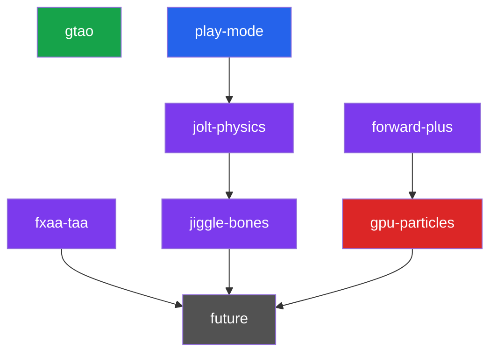

# Luth Engine — Backlog

> Definitive plan for planned epics. Each section expands the short entry in [`ROADMAP.md`](ROADMAP.md).

---

## Architecture Snapshot (as of v2.0.0)

What exists today — directly shapes sequencing for remaining work.

| Capability | Status | Notes |
|-----------|--------|-------|
| Render Graph (DAG, barriers, culling) | ✅ Graphics + compute + buffers | Shipped in `compute-gpu-culling` |
| Compute shaders | ✅ Formal pipeline, render-graph integrated | `VulkanComputePipeline` + pipeline cache |
| Draw submission | ✅ `vkCmdDrawIndexedIndirect` everywhere | GPU frustum cull on GPU |
| Buffer resources | ✅ SSBO tracked in render graph | `ResourceState::ComputeRead/Write`, `StorageBuffer` |
| Queue | ✅ Single graphics queue (compute on same) | Async compute = future |
| Forward PBR | ✅ 3 render modes, 6 descriptor sets | Forward+ extends Set 3 |
| Shadows | ✅ 4-cascade PSSM, per-cascade GPU cull | Shipped in `csm` |
| Animation | ✅ Sampling, blending, root motion, GPU skinning | Jiggle bones slot in after sampling |
| Undo/redo | ✅ 14 command types | New components need new command types |
| Scene serialization | ✅ JSON `.luth` | New components need serializer entries |
| Frame debugger | ✅ Per-draw archive + replay-then-copy, frozen-state | Shipped in `frame-debugger-sync` |

---

## Dependency Graph



> 🟢 Next · 🔵 Near-term · 🟣 Mid-term · 🔴 Advanced · ⚫ Future

`gtao` and `forward-plus` have no live dependencies — their prerequisite (`compute-gpu-culling`) has already shipped in v1.2.0.

---

## Epic: `gtao` — Ground Truth Ambient Occlusion

> **Major visual quality leap.** Skip SSAO entirely, go straight to the 2016 industry standard.

### Implementation Plan

Three compute passes + one apply pass:

| Pass | Type | Input | Output |
|------|------|-------|--------|
| **Depth prefilter** | Compute | Scene depth | Depth MIP chain (half-res) |
| **GTAO main** | Compute | Depth mips + view-space normals¹ | Raw AO term (R8 or R16F, half-res) |
| **Spatial denoise** | Compute | Raw AO + depth | Filtered AO |
| **AO apply** | Fragment (in geometry or composite) | Filtered AO | Modulated ambient lighting |

¹ *Normals can be reconstructed from depth derivatives in a forward renderer — no GBuffer required.*

### Reference
- Intel's XeGTAO (MIT, HLSL → port to GLSL)
- Jimenez et al. 2016: "Practical Realtime Strategies for Accurate Indirect Occlusion"

### Dependencies
- `compute-gpu-culling` (compute pass infrastructure) — ✅ shipped

### Estimated Effort: Medium (1-2 weeks)

---

## Epic: `play-mode`

> **Gateway to interactive gameplay.** Editor can simulate the scene at runtime.

### Key Changes

| Area | Detail |
|------|--------|
| **Scene snapshot** | Serialize scene to in-memory JSON on Play; restore on Stop |
| **Editor state machine** | `Editing → Playing → Paused → Editing` with toolbar transport controls |
| **System tick gating** | Game systems (physics, gameplay) only tick in `Playing`/`Paused+Step`; rendering always runs |
| **Time management** | Game time vs editor time separation; pause/step support |
| **Camera control** | Option to use editor camera or scene camera during play |

### Dependencies
- None (independent of rendering pipeline)

### Estimated Effort: Medium (1-2 weeks)

---

## Epic: `jolt-physics`

> **Rigid body physics.** Makes Luth a game engine, not just a renderer.

### Architecture: Jolt on CPU via Fiber Job System

Jolt exposes a `JPH::JobSystem` interface. You implement it to dispatch onto your fiber scheduler:

```cpp
class LuthJoltJobSystem : public JPH::JobSystem {
    // Map Jolt jobs → Luth::JobSystem::Execute()
    // Map Jolt barriers → Luth::AtomicCounter
};
```

### Key Changes

| Area | Detail |
|------|--------|
| **New components** | `RigidBody` (mass, restitution, friction, body type), `Collider` (box/sphere/capsule/mesh shape) |
| **PhysicsSystem** | New ECS system: `Init()` creates Jolt world, `Update()` steps simulation, syncs transforms |
| **Transform sync** | After Jolt step: `JPH::BodyInterface::GetWorldTransform()` → `Component::Transform` |
| **Debug draw** | Wireframe collider visualization in editor (Jolt provides shape → line list conversion) |
| **Raycasting** | `PhysicsSystem::Raycast()` for mouse picking, gameplay queries |
| **Editor integration** | Inspector for RigidBody/Collider, play-mode-only simulation |
| **Serialization** | RigidBody + Collider component serialization in `.luth` scenes |

### Dependencies
- `play-mode` — physics only ticks during play

### Estimated Effort: Large (2-3 weeks)

---

## Epic: `jiggle-bones` — Secondary Physics

> **Custom Verlet spring simulation.** ~200 lines, not Jolt.

### Architecture

Runs *after* animation sampling, *before* bone matrix SSBO upload:

```
AnimationSystem::Update()
  ├── Sample keyframes (existing)
  ├── Blend layers (existing)
  ├── Apply root motion (existing)
  ├── Compute global bone transforms (existing)
  └── JiggleSimulation (NEW)
       ├── Verlet integration per tagged bone
       ├── Distance constraint satisfaction (2-3 iterations)
       ├── Optional: sphere collider push-out
       └── Override bone world transforms
```

### Key Changes

| Area | Detail |
|------|--------|
| **New component** | `JiggleBone { BoneName, Stiffness, Damping, Gravity, [runtime: CurrentPos, PreviousPos] }` |
| **Chain support** | `JiggleChain { RootBoneName, ChainLength, Stiffness, Damping }` for ponytails/capes |
| **AnimationSystem** | Add jiggle simulation step after global transform computation |
| **Inspector** | Stiffness/damping sliders, gravity vector, +visualization gizmo |
| **Serialization** | New component in scene format |

### Dependencies
- None strictly, but benefits from `play-mode` for runtime testing

### Estimated Effort: Small-Medium (1 week)

---

## Epic: `forward-plus` — Clustered Lighting

> **Remove the 64 point light ceiling.** Thousands of lights with minimal overhead.

### Architecture

Replace fixed `LightUBO` with GPU-driven light assignment:

| Pass | Type | Detail |
|------|------|--------|
| **Cluster build** | Compute | Divide view frustum into 16×9×24 clusters; compute cluster AABBs |
| **Light assign** | Compute | For each light, find overlapping clusters; write light index lists |
| **GeometryPass** | Fragment | Read cluster for current fragment → iterate assigned lights only |

### Key Changes

| Area | Detail |
|------|--------|
| **Light SSBO** | Replace `LightUniforms` (fixed 64 lights) with unbounded SSBO |
| **Cluster SSBO** | Per-cluster light index list + offset/count table |
| **PBR shader** | Read cluster ID from fragment position; iterate cluster's light list |
| **Point light cap** | Raise from 64 to unlimited (practical: thousands) |

### Dependencies
- `compute-gpu-culling` (compute passes for cluster build + light assignment) — ✅ shipped

### Estimated Effort: Medium-Large (2 weeks)

---

## Epic: `fxaa-taa` — Anti-Aliasing

> **FXAA is a quick win.** TAA is more complex but pairs well with GTAO temporal accumulation.

| Technique | Effort | Notes |
|-----------|--------|-------|
| **FXAA** | Small (1-2 days) | Single fullscreen post-process pass. Well-known GLSL implementation (Lottes 2011). Drop-in after post-process. |
| **TAA** | Medium (1 week) | Requires motion vectors (per-object velocity buffer), jitter pattern (Halton), history buffer, neighborhood clamping. But improves GTAO + removes temporal flickering everywhere. |

### Dependencies
- FXAA: None (can be done anytime)
- TAA: Velocity buffer needs per-object previous-frame transforms (pairs with GPU object buffer from `compute-gpu-culling`)

---

## Epic: `gpu-particles` — GPU Particle System

> **First fully GPU-driven simulation.** Compute emit → simulate → render via indirect draw.

### Architecture

| Pass | Type | Detail |
|------|------|--------|
| **Emit** | Compute | Spawn particles from emitter configs, write to particle SSBO |
| **Simulate** | Compute | Integrate positions, apply forces/gravity, decay lifetime, kill dead |
| **Compact** | Compute | Stream compaction to remove dead particles (parallel prefix sum or atomic append) |
| **Render** | Graphics (indirect) | Point sprites or billboards via `vkCmdDrawIndirect` with GPU-computed count |

### Dependencies
- `compute-gpu-culling` (compute + indirect draw infrastructure) — ✅ shipped
- `forward-plus` (for lit particles, optional)

### Estimated Effort: Large (2-3 weeks)

---

## Future (Not Scoped)

Backlog beyond current planned epics, ordered roughly by value:

| Feature | Depends On | Notes |
|---------|-----------|-------|
| **Shadow frustum-union fit** | `game-panel` | CSM currently refits per view (2× shadow cost with game panel open); one union fit covers all active views |
| **Frame Debugger per-view capture** | `game-panel` | Capture currently scene-view-only; extend tracked RTs + archive slots to tag by view |
| **Scene-panel post-process toggle** | — | Unity-style toggle to disable bloom/tonemap/vignette for lookdev (gate `AddPostProcessPass` + route SceneColor straight to ImGui) |
| **HZB Occlusion Culling** | `compute-gpu-culling` | Two-phase cull pipeline; depth pyramid generation as compute |
| **Prefab System** | `play-mode`, `jolt-physics` | Entity templates with override tracking |
| **Scripting (C# or Lua)** | `play-mode`, `jolt-physics` | Requires play mode + physics for meaningful scripts |
| **Asset Streaming** | `compute-gpu-culling` | Async GPU upload via transfer queue |
| **Deferred GBuffer** | `forward-plus` | If Forward+ hits limits; unlocks SSR, decals |
| **SSR (Screen-Space Reflections)** | GBuffer or depth | Hi-Z traced reflection |
| **Volumetric Fog** | `compute-gpu-culling`, `forward-plus` | Froxel-based, compute-driven |
| **3D Spatial Audio** | `play-mode` | Orthogonal; integrate when demo needs it |
| **Animation Blend Trees / IK** | `jiggle-bones` | State machine + inverse kinematics |
| **Visual Shader Editor** | — | Editor luxury, low priority |

---

## Recommended Execution Order

| Priority | Epic | Target | Estimated Time |
|----------|------|--------|---------------|
| 1 | `gtao` | v1.5.0 | 1-2 weeks |
| 2 | `play-mode` | v1.6.0 | 1-2 weeks |
| 3 | `jolt-physics` | v1.7.0 | 2-3 weeks |
| 4 | `jiggle-bones` | v1.7.1 | 1 week |
| 5 | `forward-plus` | v1.8.0 | 2 weeks |
| 6 | `fxaa-taa` | v1.8.1 | 1 week |
| 7 | `gpu-particles` | v1.9.0 | 2-3 weeks |

> **Total: ~11-16 weeks of focused work** to reach a fully GPU-driven, physically-interactive engine with modern rendering.
